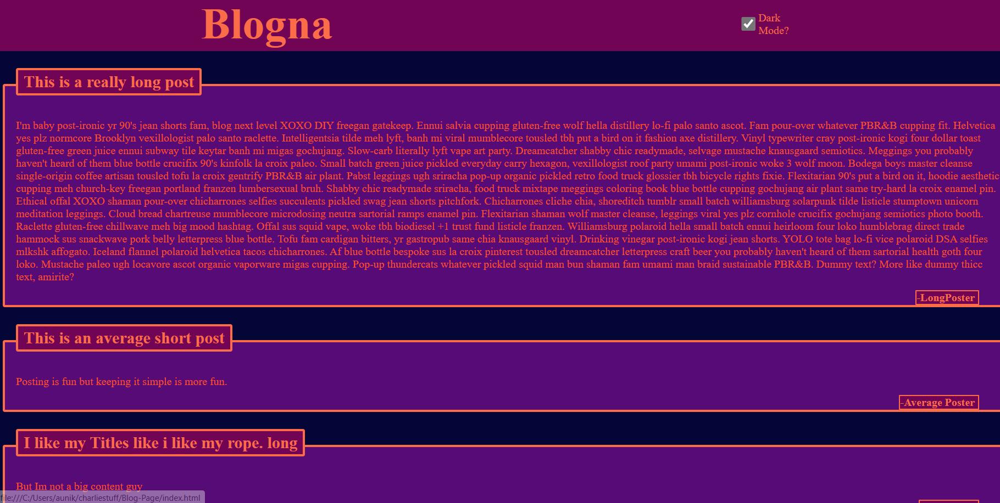

# Blogna

## Description

As a new developer I want to learn about using local storage to store and use data locally.This app uses such funcitonallity to load a dark/light theme on the page and to load blog posts to a blog page.It was a fun little app to make and while my color choices may be a little questionalble theres no doubt to me that this app functions well within the scope I intended it to cover.

## Usage

To make a post just be sure to fill all the field and then click submit. it will then take you to a psot page with all previous posts and your new post. To return to the form page click the Title in the header or click the link in the footer. 
To change the theme to dark mode simply click the check box labled "dark mode?", and to change if back just click it again.

## Deployed application

## ScreenShots

## license

Refer to licesne in repo.